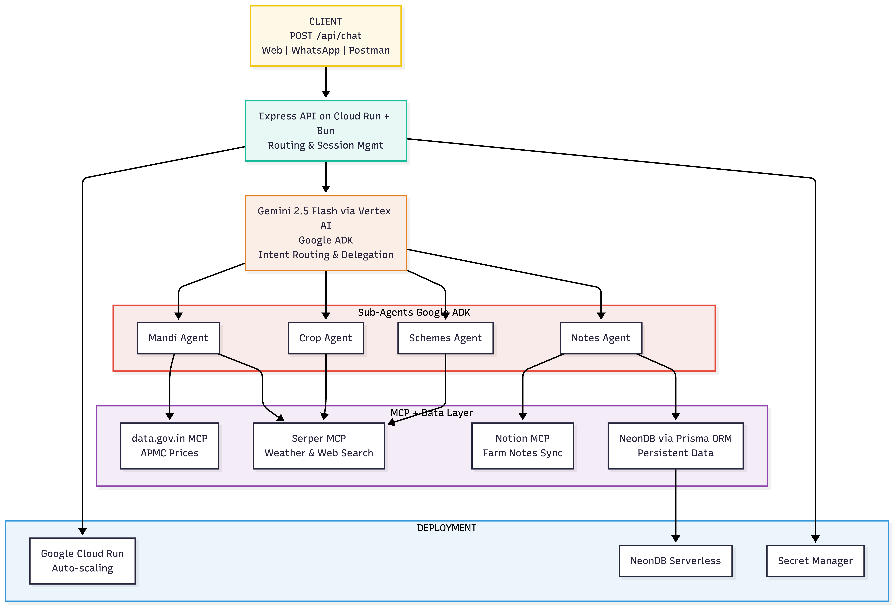

<div align="center">
  

  <br/>
  <br/>

  
  
  
  
  

  <br/>

  > **Empowering Indian farmers through intelligent, multi-agent AI orchestration — from field observations to live mandi prices, all in natural language.**

</div>

---

## 🌾 What is Pulse?

**Pulse** is a multi-agent AI ecosystem built with the **Google Agent Development Kit (ADK)** and **TypeScript**. It acts as an intelligent orchestrator that bridges the gap between Indian farmers and the information they need — whether that's real-time APMC market prices, government scheme deadlines, or crop-specific advisory — all through a single, natural language interface.

Pulse doesn't just answer questions. It **understands intent**, **delegates intelligently** to specialist agents, and **synthesizes results** back into a unified, actionable response.

---

## 🤖 The Agent Ecosystem

Pulse coordinates four specialized sub-agents, each an expert in its domain:

| Agent | Role | Key Capability |
|---|---|---|
| 🛒 **Mandi Agent** | Market Intelligence | Fetches live APMC prices and benchmarks against MSP to help farmers decide *when* to sell |
| 🌱 **Crop Agent** | Agricultural Advisory | Delivers region-specific guidance on sowing windows, soil health, and pest management via real-time search |
| 📋 **Schemes Agent** | Government Navigation | Decodes complex subsidy schemes (PM-KISAN, PMFBY) and surfaces deadlines before they're missed |
| 📓 **Notes Agent** | Field Documentation | A direct bridge to Notion — log observations, harvest records, and price snapshots via voice or text |

---

## 🏗️ System Architecture

<div align="center">
  
</div>

<br/>

Pulse is built on the **Orchestrator-Worker pattern**. The root `LlmAgent` (Pulse) receives user input, decomposes it into one or more intents, and delegates each to the appropriate sub-agent via the `AGENT_REGISTRY`. Sub-agents are dynamically wrapped as `AgentTool` objects, making them callable like native functions by the LLM.

```typescript
// All domain-specific intelligence is registered here
export const AGENT_REGISTRY: LlmAgent[] = [
  cropAgent,
  mandiAgent,
  schemesAgent,
  notesAgent, // Integrated with Notion
];
```

The orchestrator never hard-routes. It relies on **Gemini 2.5 Flash** to infer intent and compose multi-agent workflows on the fly.

---

## ⚙️ Technical Stack

| Layer | Technology |
|---|---|
| **Agent Framework** | Google Agent Development Kit (ADK) |
| **Language** | TypeScript |
| **LLM** | Gemini 2.5 Flash via Vertex AI |
| **Runtime** | Bun / Node.js (v20+) |
| **Database** | NeonDB (PostgreSQL) |
| **ORM** | Prisma |
| **Live Search** | Serper MCP |
| **Notes Integration** | Notion API |

---

## 🔄 End-to-End Process Flow

Here's a full example of Pulse handling a compound query:

```
User  ──▶  "What is the current onion price in Lasalgaon and save it to my notes?"
```

```
1. PARSE      Pulse identifies two intents: Market Price + Documentation
              │
2. DELEGATE   ├──▶ mandiAgent   → Queries Serper MCP for live APMC data
              └──▶ notesAgent   → Prepares to write structured entry to Notion
              │
3. EXECUTE    Both agents run; results are collected
              │
4. SYNTHESIZE Pulse composes a unified response:
              ✅ "Onion at Lasalgaon: ₹1,840/quintal (MSP: ₹1,550)"
              ✅ "Saved to your Notion field diary."
```

---

## 🚀 Getting Started

### Prerequisites

- [Bun](https://bun.sh) or Node.js v20+
- Google Cloud Project with **Vertex AI** enabled
- A Notion integration with an API token

### 1. Clone the Repository

```bash
git clone https://github.com/your-username/pulse-adk.git
cd pulse-adk
```

### 2. Install Dependencies

```bash
bun install
```

### 3. Configure Environment

Create a `.env` file in the project root:

```env
GOOGLE_API_KEY=your_google_api_key_here
NOTION_API_KEY=your_notion_token_here
DATABASE_URL=your_database_url
```

### 4. Run in Development Mode

```bash
bun run dev
```
